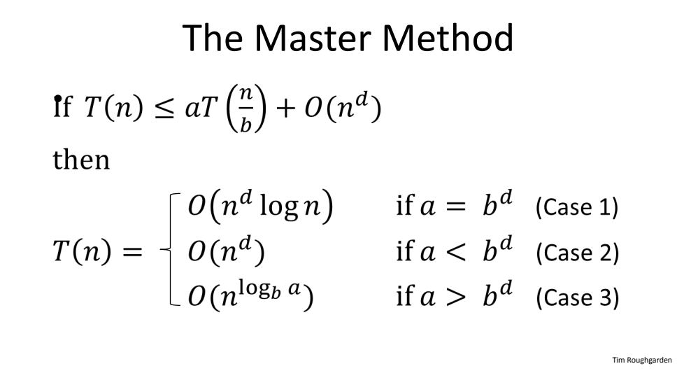

## Divide And Conquer
Take a problem, break it down into smaller sub problems which are then solved recursively and then combine the results of the smaller sub-problem to get a solution to the original problem.
## The Master Method

Upper Bound on the work at level j : 

$cn^d\times(\frac{a}{b^d})^j$

Interpretation 
a = Rate of Subproblem Proliferation (RSP)
b = Rate of Work Shrinkage (RWS) \
(per subproblem)

For total work you just sum it up on j from 0 to $\log_b n$

# Graphs
* Vertices (Nodes)
* Edges (Pairs of Vertices)
  * Can be directed (ordered, arcs) or undirected
 ## Cuts of Graphs 
 Partition V into two non empty disjoint subsets
 Crossing edges :
 &rarr; one endpoint in each A and B (undirected)
 &rarr; tail in A, head in B (directed)
**Minimum Cut :** 
&rarr; A cut with fewest number of crossing edges.
* Applications
	* Identifying network bottlenecks/weaknesses   &rarr; A minimum cut reveals critical points in network infrastructure where a small number of edge removals could disconnect the network
	* <u>Community detection in Social Networks </u>   &rarr;  Finding minimum cuts to partition the network into groups with the fewest connections between them.
	* Image Segmentation   &rarr; Minimum cuts to separate an image into meaningful regions with minimal "disagreement" across the boundary.   &rarr; This process involves: 
		-   Representing an image as a graph where pixels are nodes
		-   Assigning edge weights based on pixel similarity (color, intensity, texture)
		-   Using these weights to determine which pixels likely belong to the same object
		-   Applying minimum cuts repeatedly to identify distinct objects within the image. 
		&rarr; The edge weight principle is crucial: a high weight between pixels u and v indicates they likely belong to the same object.

**Edge Weight :** A numerical value assigned to an edge that represents some attribute of the connection between two nodes.

 **Sparse v/s Dense Graphs**
&rarr; In a sparse graph, number of edges m is closer to O(n) where n is number of vertices
&rarr; In a dense graph, m is closer to $\Omega$($n^2$)

---
### Adjacency Lists and Adjacency Matrices
**1. Adjacency Lists**
A graph is represented using two arrays:   &rarr; *Vertices array*: Stores all vertices.
&rarr; *Edges array*: Stores all edges, with each edge pointing to its two endpoints.
-   Space Complexity :  O(n+m) 
-   Efficiency:
    -   Iterating over edges incident to a vertex:  O(degree(v)).
    -   Checking if two vertices are connected:  O(degree(v))  (inefficient for this operation).
-   Use Cases:
    -   Sparse graphs (where  $m \ll n^2$).
    -   Algorithms requiring traversal of edges (e.g., BFS, DFS, Dijkstra’s algorithm).
---
**2. Adjacency Matrices**
A 2D array where entry (i, j) is 1 if there’s an edge from vertex  i  to  j, and 0 otherwise. For weighted graphs, entries store edge weights.
-   Space Complexity:  O($n^2$), making it inefficient for sparse graphs.
-   Efficiency:
    -   Checking edge existence:  O(1).
    -   Iterating over all edges:  O($n^2$) (inefficient for sparse graphs).
-   Use Cases:
    -   Dense graphs (where  $m \approx n^2$ ).
    -   Applications requiring frequent edge-existence checks (e.g., small graphs in dynamic programming).